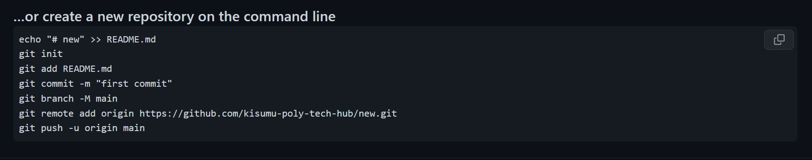
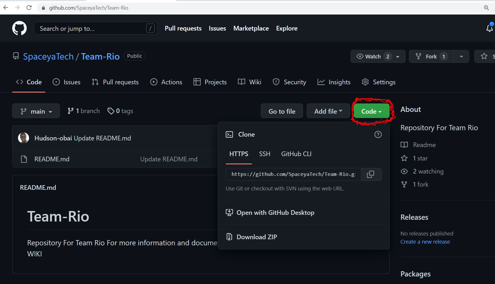
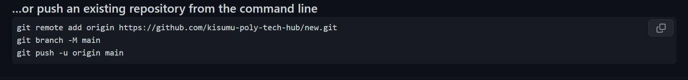

# Team-Rio
Repository For Team Rio

> # VERSION CONTROL 

# VERSION CONTROL WITH GIT AND GITHUB :gear:


<p> Before we start, we recommend to use  vscode and the linux OS i.e any distribution for best developer experience. this doesnt mean windows or macOs won't work all the commands are universally compatible. 
</p> 

> ## This illustration is done on the ubuntu terminal. 

> When creating new project on the local machine.
*  launch terminal ``` ctrl + Alt + T ```
*  move to the project directory ie. Desktop/Project  ```cd Desktop/Project ```
*  or create a new project directory ```mkdir Project```
*  then change into the project directory ```cd Project```

*  initialise our folder to a git repository ```git init```
*  create a file using vscode ```<new>``` 
*  for those who wouldn't wish to leave terminal yet you could use "pico" ```pico <new>```
*  add some content into the file for this case we would be using ```Hello Team Rio```
* Saving a file in the terminal editor (Nano/Pico) 
* Press ```CTRL + O``` to save the file, type the file name, and hit ```ENTER```
* or If you already opened the file by typing ```nano <filename>``` When you are done making your changes, press ```CTRL + O``` and hit ```ENTER``` to save the changes.
*  we could at this point want to check the working tree ```git status```
*  add a file to the working tree. ```git add -A```
*  committ the change to our repository. ```git commit -m <new>```
*  check the status. ```git status```
> Working with Branches
*  create a branch  ```git branch <new branch name>```
*  create and switch to a branch ```git checkout -b <new branch name>```

<p float="left">

</p>

> When cloning a git repository onto your local machine. ```(HTTPS option)```
*  launch terminal ``` ctrl + Alt + T ```
*  move to the project directory ie. Desktop/Project  ```cd Desktop/Project ```
*  or create a new project directory ```mkdir Project```
*  then change into the project directory ```cd Project```
* identify the repository you would wish to clone from github
<p float="left">

</p>

* copy the url link to your terminal window ```git clone https://github.com/SpaceyaTech/Team-Rio.git```
* identify files to change and start editing.
* run git status to check on the working tree ```git status```
* before we make any commits we should change to our own branch since this is a group project. 
*  create a different branch.  ```git branch <new branch name>```
* changing into the branch ```git checkout -b <new branch name>```
* add your edits to the working tree by running ```git add <filename(s)>```
* commit the change to our repository. ```git commit -m "our commit message" ```
## <p> after we have commited the changes we have to push our code to github we could run a number of commands for this: </p>
* ```git remote```
* ```git fetch```
* ```git push```
* ```git pull```

> for this case we will only use ```remote``` and ```push```
* we will use the remote link ```origin``` that was created when we cloned this repository. 
* else you can add the remote link by typing ```git remote add <name> <url>``` 
* then push using ```git push <remote name> <branch>```
<p float="left">

</p>
## <p>for the team-rio repository we do the following:</p>

* we set up the upstream to the main repository ```git remote add origin https://github.com/SpaceyaTech/Team-Rio.git```
* then we push our code ```git push -u origin <branch name>```

> When cloning a git repository onto your local machine. ```(SSH option)```

> ## This is open to edits and more contribution.

> ## An illustration on VSCode is also welcome.
